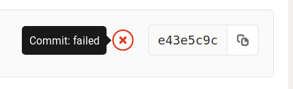
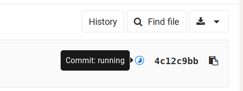

# Mif01 - TP Maven-Git-Forge

## Objectif

Mettre en place et maîtriser les outils de gestion de code utilisés tout
au long de l’année.

- Outil de build avec Maven (mvn)
- Outil de versioning avec Git (git)
- Outil de gestion de projet avec GitLab (la Forge)
- Plus de confort et d'efficacité avec un bon IDE

Ce TP devrait vous prendre environ une séance.

## Déroulement

Ce TP est à réaliser de préférence sous Linux (accès facile à `mvn` et `git` en
ligne de commande). Il est vivement recommandé de faire les manipulations dans
un terminal (éventuellement le terminal intégré de votre IDE préféré) pour avoir
une maîtrise complète de ce qu'il se passe, et connaître les noms exacts des
commandes, ce qui est indispensable pour pouvoir rechercher de l'aide. Une fois
les bases de `mvn` et `git` bien maîtrisées, vous aurez peut-être envie
d'utiliser les outils graphiques et les raccourcis clavier intégrés à votre
éditeur de texte ou IDE.

Sur les machines de Lyon 1, Maven n'est pas installé sous Windows.
Vous pouvez tout de même travailler sous Windows mais vous devrez
[installer Maven sur votre
compte](https://www.mkyong.com/maven/how-to-install-maven-in-windows/).
Vous pouvez aussi travailler sous Linux pour les manipulations avec
`mvn`.

Pour les TPs suivants, il sera quasi-indispensable d'utiliser un IDE (VSCode,
IntelliJ, Eclipse, ...).

## Git et la GitLab

### Configuration de base de Git

Vous devriez déjà avoir fait un fork de votre projet sur la forge, et
un `git clone` pour en récupérer une copie locale. Si ce n'est pas le
cas, reprenez les instructions du [TP1-java](../TP1-java). Dans tous
les cas, assurez-vous que votre projet est privé et que vos enseignants
y ont accès.

Vous pouvez passer directement à la section suivante si vous avez déjà
configuré Git sur votre machine.

Sur votre ordinateur, si vous n'avez pas encore configuré Git correctement, ajoutez les informations de base
à votre compte git (les données seront rangées dans un fichier
`~/.gitconfig`, que vous pouvez aussi éditer à la main si vous
préférez). Dans un terminal, faites :

```sh
git config --global core.editor "votre_editeur_prefere"
git config --global user.name "Nom Prenom"
git config --global user.email "votre_email@etu.univ-lyon1.fr"
```

La première ligne spécifie l'éditeur de texte à utiliser pour saisir
les messages de commits. Vous pouvez spécifier par exemple `vim` ou
`emacs`. Si vous utilisez VSCode, écrivez ici `code --wait` (la commande
`code` sans `--wait` va chercher à se connecter à un VSCode existant,
et la commande terminerait immédiatement, et Git va croire que vous avez
terminé l'édition, avec un message de commit vide). Pour les mêmes raisons pour
gvim écrivez ici `gvim -f` et si vous utilisez gedit, `gedit -s`.

Les lignes positionnant les variables `user.name` et `user.email` seront utilisées pour le champ « auteur » des
commits que vous ferez. Utilisez votre vrai nom et prénom (pas votre login) et
votre adresse email.

Pour vous assurer que votre environnement est opérationnel, faites une
modification triviale (par exemple adapter l'URL de votre projet dans
`pom.xml`, mais vous avez sans doute également les modifications
non-commitées du TP1), puis faites un commit et un push :

```sh
git status
git add pom.xml
git commit
git push
```

Dans le navigateur, ouvrez la page de votre projet sur la forge : vous
pouvez voir les révisions déjà présentes et même regarder le code
source en ligne, ainsi que les différences entre les révisions.

Il est probable que vous voyez une erreur comme celle-ci :



Ne paniquez pas : le commit est bien là, c'est l'intégration continue
qui a échouée, vous verrez pourquoi à la fin du TP.

### .gitignore et gestion d’un ticket

Les utilitaires comme Maven génèrent un grand nombre de fichiers qu'il ne faut
pas ajouter à vos dépôts (cela utiliserait énormément d'espace disque
inutilement, et dérangerait vos coéquipiers car les fichiers générés sur votre
machines ne sont pas pertinents sur une autre). Vous allez donc configurer ce
projet de manière à les ignorer. Pour cela vous allez utiliser en plus l'outil
de gestion de tickets.

#### Suppression éventuelle des fichiers qui n'auraient jamais du être là

Les fichiers générés par Maven se trouvent tous dans le répertoire `target/`.
Ils ne devraient pas être trackés par Git (personne n'a envie de faire des merge
sur des fichiers `.class` ...), mais il est possible que des fichiers aient été
ajoutés par erreur. Vérifions. On doit voir les fichiers générés sur le disque :

```sh
$ ls target
... classes/  maven-status/  surefire-reports/  test-classes/ ...
$
```

mais pas comme fichiers gérés par Git (la commande ne renvoie rien) :

```sh
$ git ls-files target
$ 
```

Si `git ls-files target` affiche des noms de fichiers, c'est que vous (ou votre
binôme) les avez ajoutés par erreur. Un `git log target` vous pointera le
coupable. C'est embêtant car ces fichiers prennent de l'espace disque pour rien
dans votre historique, et les supprimer maintenant ne vous rendra pas cet espace
disque : ce qu'il aurait fallu faire, c'est travailler proprement dès le début
(commencez par prendre l'habitude de faire un `git status` avant chaque
commit) ! Mais réparons ce qui est encore réparable :

```sh
git rm -r target/
git commit -m "Suppression du répertoire target/, qui n'aurait jamais du être ajouté"
```

#### Fichiers ignorés

Depuis l'interface web de la forge, créez une nouvelle demande
(*issue*) intitulée : “ignorer le répertoire target et les fichiers des
IDE”. En effet, ce dossier `target` sera créé par Maven au moment du build, et
contiendra les fichiers `.class` et le jar. Les fichiers comme
`.classpath` sont générés par les IDE comme Eclipse et ne doivent pas
être versionnés (pas de `git add .classpath`), car ceux-ci peuvent être
différents d'un utilisateur à l'autre (par exemple parce qu'ils
contiennent des chemins absolus comme `/home/toto/.m2/...`).

Accédez à la liste des demandes de votre projet puis modifiez la demande
précédente en affectant un des membres du projet à cette tâche. Notez bien
le numéro `#xxxx` de la demande (sans doute `#1`).

Créez un fichier `.gitignore` à la base du répertoire `mes/` et
ajoutez-y les lignes suivantes :

```gitignore
# Ignore les fichiers de configurations de VS code
.vscode/

# Ignore les fichiers de configuration d'Eclipse
.classpath
.project
.settings/

# Ignore les fichiers de configuration d'Intellij
.idea/
*.iml
*.iws

# Ignore les fichiers produits par Maven pour ne versionner que le code,
# pas les executables ou les logs.
log/
target/
```

Ce fichier contient la liste des fichiers que git doit ignorer : la commande
`git status` ne les mentionnera pas dans la section `Untracked files`, et la
commande `git add` refusera par défaut de les ajouter. Si vous aviez déjà fait
un `git add` sur ces fichiers, alors les fichiers déjà ajoutés restent trackés
par Git (cf. ci-dessus pour les supprimer explicitement avec `git rm`).

```sh
git status
```

n’affiche à présent plus les fichiers dans `target/`, mais affiche le
fichier `.gitignore`. Ajoutez ce fichier dans les fichiers versionnés :

```sh
git add .gitignore
```

puis valider en indiquant `fixes \#1` dans le message de commit (en remplaçant
`1` par le vrai numéro de l'issue si besoin) :

```sh
git commit -m "Gestion des fichier à ignorer (fixes #1)"
```

puis faire le push

```sh
git push
```

Dans le projet forge, via votre navigateur, allez voir le dépôt et cliquez sur le dernier
commit. Vous pouvez vérifier que le `#1` est un lien vers votre
demande, et que la présence de `fixes #1` dans un message de commit
a automatiquement fermé le ticket correspondant.

Votre [projet](../projet-note.md) devra impérativement ignorer tous les fichiers
générés (qui ne doivent bien sûr pas être trackés), et avoir au moins une «
issue » GitLab (fermée) (vous perdrez des points sur la note sinon).

### Un gitignore local par utilisateur

Vous avez sans doute vos habitudes et vos outils qui vous font
manipuler des fichiers que vous ne voulez pas partager et donc ajouter
au `.gitignore` (par exemple, ignorer `*~` si votre éditeur de texte
laisse des `fichier~` en guise de backup, ou ignorer `.DS_Store` si
vous êtes sous Mac OS). Mais d'une part, vous voulez ignorer ces fichiers
pour tous vos projets (sans avoir à modifier le `.gitignore` de chaque
projet), et d'autre part vous ne voulez pas forcément faire gonfler le
`.gitignore` des projets auxquels vous contribuez avec des entrées qui
ne concernent pas les autres.

Pour cela, il existe un fichier `~/.config/git/ignore` (le créer s'il
n'existe pas). Mettez-y par exemple ce contenu :

```gitignore
# Emacs's backup files
*~

# Mac's .DS_Store
.DS_Store
```

### Gérer les conflits

Nous n’allons pas mettre en pratique en détails la gestion de conflits dans ce TP,
mais c’est quelque chose qui arrive fréquemment. La [documentation de Git
traite du
sujet](https://git-scm.com/book/fr/v2/Les-branches-avec-Git-Branches-et-fusions%C2%A0%3A-les-bases)),
et [Github a un guide expliquant plutôt bien les
choses](https://help.github.com/articles/resolving-a-merge-conflict-using-the-command-line/) si vous ne maîtrisez pas encore cette notion.

Pour télécharger la dernière version depuis le dépôt et la fusionner
avec votre version locale, faire :

```sh
git pull
```

Pour lancer la fusion de deux branches locales, on utilise la commande merge :

```sh
git merge <branche-a-fusionner>
```

Les conflits interviennent souvent lors du pull d’une branche dans la
branche courante. Cette commande importe les modifications de la branche
crée lors du pull dans la branche courante.

`git status` signale les fichiers en conflits. Éditer ces fichiers
pour intégrer de manière cohérente les modifications effectuées dans
le deux branches. Une fois les modifications effectuées, si la
construction `mvn install` fonctionne, indiquer que les conflits sont
résolus via

```sh
git add le_fichier_concerne
# commit, sans l'option -a
git commit
```

### Travail avec plusieurs dépôts distants

Si vous avez suivi les instructions jusqu'ici, vous devriez travailler
avec deux dépôts distants :

- https://forge.univ-lyon1.fr/matthieu.moy/mif01-2022, qui est le
  squelette fourni par les enseignants. Vous n'y avez accès qu'en
  lecture (`pull`, `clone`).
  
- `https://forge.univ-lyon1.fr/<votre-login>/mif01-2022`, qui est votre
  « fork » privé. Vous avez tous les droits dessus, y compris `push`.

Pour votre travail au quotidien, c'est votre dépôt privé que vous
utiliserez. Mais quand les enseignants envoient des nouveautés (ou des
corrections) dans le dépôt enseignant, vous devez également vous
mettre à jour :

Ajoutez le dépôt enseignant comme dépôt distant (à faire une fois en
début de projet) :

```sh
git remote add moy https://forge.univ-lyon1.fr/matthieu.moy/mif01-2022.git
```

Votre fork est déjà enregistré comme remote `origin` au moment du `git clone`.

Pour récupérer les mises à jour du dépôt enseignant, faites (à chaque fois qu'il y a des nouveautés dans le dépôt enseignant) :

```sh
git pull --no-rebase moy main  # Récupérer les modifications en local
git push  # Les envoyer vers votre fork privé
```

L'option `--no-rebase` est pertinente ici pour éviter de rebaser l'ensemble de
votre historique par dessus l'historique du dépôt enseignant.

En résumé :

```
git commit          # enregistrer vos modifications, localement
git pull            # récupérer les changements depuis votre fork (de votre binôme)
git push            # envoyer des changements à votre fork
git pull --no-rebase moy main # récupérer les mises à jour du dépôt enseignant
```

## Maven

### Invocation de Maven

Vous avez déjà vu au TP précédent la commande pour compiler :

```sh
mvn compile
```

Le répertoire `target/` contient tout ce qui est généré par Maven. Explorer
le contenu du répertoire, puis invoquer

```sh
mvn clean
```

Regarder ce qui a été supprimé.

On peut lancer les tests associés au projet avec :

```sh
mvn test
```

La phase de vérification doit renvoyer au moins une erreur : vos
enseignants sont taquins et vous ont volontairement fourni du code
avec un ou des défauts. Vous corrigerez ces défauts un peu plus tard.

En pratique on veut souvent nettoyer le dossier `target/`, et relancer le
processus de build, tests compris :

```sh
mvn clean install
```

Pour lancer l’application en ligne de commande on utilise :

```sh
mvn compile
mvn exec:java
```

Ou bien, on peut lancer l'application via la commande `java` après
avoir généré le `.jar` avec `mvn install`:

```sh
# Pour cette fois, on autorise la construction du .jar même en
# présence d'erreur dans le tests et le style (-DskipTests
# -Dcheckstyle.skip) :
mvn -DskipTests  -Dcheckstyle.skip install
```

### Packaging

Le plugin `maven-assembly-plugin` est configuré pour vous pour
générer un jar exécutable incluant les bibliothèques utilisées (voir
[ici](http://stackoverflow.com/questions/574594/how-can-i-create-an-executable-jar-with-dependencies-using-maven)).

Tester en lancer java via (adaptez l'argument de `--module-path` à
votre installation si besoin) :

Sous Linux au Nautibus :

```sh
java --module-path /home/tpetu/m1if01/javafx-sdk-11.0.2/lib --add-modules=javafx.controls -jar target/mes-0.0.1-SNAPSHOT-jar-with-dependencies.jar
```

Sous Ubuntu avec le package `openjfx` installé :

```sh
java --module-path /usr/share/openjfx/lib --add-modules=javafx.controls -jar target/mes-0.0.1-SNAPSHOT-jar-with-dependencies.jar
```

## Intégration continue avec GitLab-CI

### Principe

Le principe de l'intégration continue (Continuous Integration, CI) est
de maintenir une base de code opérationnelle en permanence. Pour cela,
on lance des tests (automatiques) le plus souvent possible.
[Gitlab-CI](https://docs.gitlab.com/ee/ci/quick_start/) permet de
lancer des tests à chaque push envoyé sur la forge. Un ensemble de
tests à lancer s'appelle un « pipeline » dans la terminologie GitLab.

Avant tout, vérifiez que les pipelines sont activés sur votre projet :

- Ouvrez la page d'accueil de votre projet dans votre navigateur.

- Dans la barre latérale de gauche, en bas, « Settings → General »,
  puis « permissions ». (Vous devriez retrouver « project visibility =
  private », si ce n'est pas le cas relisez le début de ce document,
  c'est important).
  
- Vérifiez que l'interrupteur « pipelines » est sur « enabled ».

- Si vous avez modifié quelque chose, cliquez sur « save changes ».

Il faut maintenant dire à GitLab quelle commande il doit lancer à
chaque push, et dans quel environnent. Cela se fait dans le fichier
`.gitlab-ci.yml` à la racine de votre projet Git. Un `.gitlab-ci.yml`
typique pour un petit projet (*pas* pour le nôtre) ressemble à ceci :

```yaml
tests:
  image: ubuntu
  script:
  - ./my-test-script.sh
```

Avec cette configuration, le moteur d'intégration continue va lancer
le script `my-test-script.sh` dans un conteneur Docker (sorte de
machine virtuelle) sur lequel est installé Ubuntu. Si
`my-test-script.sh` a un statut de retour non-nul (par exemple s'il
termine par `exit 1`), on considère que les tests échouent.

### Mise en place

Pour notre projet, nous vous fournissons un `.gitlab-ci.yml` qui fait
un peu plus que cela. Ouvrez le fichier
[../.gitlab-ci.yml](../.gitlab-ci.yml). Ce fichier permet de :

- Utiliser une image docker sur laquelle Maven et JavaFX sont
  disponibles.

- Configurer le proxy HTTP pour Maven (via le script setup-mvn-proxy.sh). Ce
  point est spécifique à notre installation GitLab, on n'a en général pas besoin
  de cela mais c'est nécessaire pour nous pour que Maven marche.
  
- Mettre en cache le répertoire `.m2/repository`, pour éviter de
  re-télécharger toutes les dépendances à chaque pipeline.
  
Ouvrez ce fichier dans votre éditeur de texte. La dernière ligne
(derrière `script:`) ne fait pour l'instant rien d'intelligent.
Remplacez-la par :

```yaml
    - cd mes && mvn test --batch-mode
```

(Attention, l'indentation compte : cette ligne doit être indentée en
retrait de la ligne `script:` qui précède)

Faites un `commit` pour valider ce changement, et envoyez-le sur la
forge avec `git push`. Ouvrez la page d'accueil de votre projet dans
votre navigateur.

Le dernier commit est affiché, et vous devez maintenant avoir un
indicateur « commit: running » :



Au bout d'un certain temps, l'indicateur passera en rouge : le projet
que nous vous fournissons ne passe volontairement pas les tests !

Pour avoir une notification par email à chaque échec de pipeline,
choisissez dans la barre latérale : « Settings → Integrations », puis
« Pipelines emails ».

Vous pouvez examiner la sortie de la commande `mvn test` lancée par
GitLab en choisissant dans la barre latérale de l'interface web : « CI / CD → Jobs » puis
en choisissant le dernier commit passé (le premier dans la liste). Si
vous avez correctement réalisé l'étape précédente vous devriez voir la
sortie de Maven.

### Correction des défauts

Pour corriger les problèmes, le mieux est de travailler en local.
L'échec sur la forge se produit à l'exécution de la commande `mvn test`, donc vous pouvez reproduire le problème en faisant `mvn test`
de votre côté.

Il y a deux choses à corriger :

- Un test échoue (vous devez avoir le message
  `[ERROR] Tests run: 3, Failures: 1, Errors: 0, Skipped: 0`).
  Ouvrez le fichier `HealthProTest.java` et regardez rapidement son
  contenu. Un commentaire `TODO` vous dit ce qu'il faut corriger :
  faites-le et relancez les tests.

- Dans `HealthProfessional.java`, une erreur de style attrapée par le [plugin
  maven](https://maven.apache.org/plugins/maven-checkstyle-plugin/) de l'outil
  [checkstyle](http://checkstyle.sourceforge.net/). Un `TODO` devrait vous
  indiquer ce qu'il faut faire. Vous avez peut-être introduit d'autres
  violations de style en faisant le TP jusqu'ici, il faudra les corriger
  rapidement (mais lisez ce qui suit sur les IDE, cela peut vous faire gagner
  beaucoup de temps !)
  
Une fois ces deux corrections faites, vérifiez que `mvn test` ne lève
plus d'erreur, faites un commit et un push, et vérifiez que
l'intégration continue de la forge valide ce commit.

## IDE et plugins, un peu de confort ...

Lancer `mvn` en ligne de commande puis chercher à la main l'emplacement des erreurs pour les corriger n'est pas idéal. La plupart des éditeurs de textes et IDE peuvent faire bien mieux. Quelques astuces qui peuvent faciliter la vie.

Avec tout IDE digne de ce nom, si vous avez ouvert le projet correctement, vous devriez avoir les erreurs Java affichées directement dans le code (soulignées en rouge en général).

### Sous VSCode

- VSCode a un plugin [checkstyle](https://marketplace.visualstudio.com/items?itemName=shengchen.vscode-checkstyle), qui vous permet d'avoir les erreurs checkstyle directement dans le code (comme les warnings Java).

- Un autre outil similaire pour aider à écrire du code de qualité : le plugin [SonarLint](https://marketplace.visualstudio.com/items?itemName=SonarSource.sonarlint-vscode).

- On peut reformater automatiquement une portion de code avec <kbd>Ctrl</kbd>+<kbd>k</kbd> <kbd>Ctrl</kbd>+<kbd>f</kbd>.

### Sous Eclipse

- Eclipse a un plugin [checkstyle](https://checkstyle.org/eclipse-cs/#!/), qui vous permet d'avoir les erreurs checkstyle directement dans le code (comme les warnings Java).

- Un autre outil similaire pour aider à écrire du code de qualité : le plugin [SonarLint](https://www.sonarlint.org/eclipse/).

- On peut reformater automatiquement une portion de code avec <kbd>Ctrl</kbd>+<kbd>Shift</kbd>+<kbd>f</kbd>.

### Sous IntelliJ

L'auteur de ce document n'a pas pu tester, mais il existe aussi un plugin [checkstyle](https://plugins.jetbrains.com/plugin/1065-checkstyle-idea).

## Quelques détails sur le pom.xml

Si ce n'est pas déjà fait, parcourez le fichier `pom.xml`. C'est
verbeux (XML), mais il n'y a rien de sorcier. En pratique, on édite
rarement ce fichier entièrement à la main : soit on utilise un outil
automatique, soit on copie-colle et on adapte des portions de code
fournies sur le site des outils utilisés (https://search.maven.org/
est un bon point de départ pour chercher les dépendances disponibles).
Pour le cas qui nous intéresse, les portions importantes sont :

Le plugin `exec-maven-plugin` pour lancer l'application :

```xml
  <plugin>
    <groupId>org.codehaus.mojo</groupId>
    <artifactId>exec-maven-plugin</artifactId>
    <version>1.5.0</version>
    <executions>
        <execution>
            <goals>
                <goal>java</goal>
            </goals>
        </execution>
    </executions>
    <configuration>
        <mainClass>fr.univ_lyon1.info.m1.mes.App</mainClass>
    </configuration>
  </plugin>
```

L'important ici est de spécifier la classe principale (`<mainClass>`).

Les tests utilisent l'API JUnit (pour le lancement des tests) et Hamcrest (pour les assertions contenues dans les tests).

```xml
    <dependencies>
        <!-- https://mvnrepository.com/artifact/org.junit.jupiter/junit-jupiter-engine -->
        <dependency>
            <groupId>org.junit.jupiter</groupId>
            <artifactId>junit-jupiter-engine</artifactId>
            <version>5.9.0-M1</version>
            <scope>test</scope>
        </dependency>
        <!-- https://mvnrepository.com/artifact/org.hamcrest/hamcrest-all -->
        <dependency>
            <groupId>org.hamcrest</groupId>
            <artifactId>hamcrest</artifactId>
            <version>2.2</version>
            <scope>test</scope>
        </dependency>
```

Ces morceaux de codes sont copié-collé depuis les URLs données en commentaire.

La mention `<scope>test</scope>` permet de rendre cette dépendance disponible
pendant la commande `mvn test`, mais pas dans les exécutions autres que les
tests (autrement dit, notre application elle-même ne pourra pas dépendre de
JUnit, même par accident).

Le plugin checkstyle :

```xml
  <plugin>
      <!-- https://maven.apache.org/plugins/maven-checkstyle-plugin/usage.html -->
      <groupId>org.apache.maven.plugins</groupId>
      <artifactId>maven-checkstyle-plugin</artifactId>
      <version>3.1.2</version>
      <executions>
          <execution>
              <id>validate</id>
              <phase>test</phase>
              <configuration>
                  <configLocation>src/main/config/checkstyle.xml</configLocation>
                  <encoding>UTF-8</encoding>
                  <consoleOutput>true</consoleOutput>
                  <!-- mvn test fails for any warning or error -->
                  <failsOnError>true</failsOnError>
                  <violationSeverity>warning</violationSeverity>
              </configuration>
              <goals>
                  <goal>check</goal>
              </goals>
          </execution>
      </executions>
      <dependencies>
          <dependency>
              <groupId>com.puppycrawl.tools</groupId>
              <artifactId>checkstyle</artifactId>
              <version>8.36.1</version>
          </dependency>
      </dependencies>
  </plugin>
```

Checkstyle peut être configuré pour forcer des règles différentes selon les
projets. Le fichier de configuration est spécifié avec `<configLocation>`. Ici,
il est configuré de manière assez stricte : la validation échoue pour les
warnings et pas seulement pour les erreurs. On demande à exécuter pendant `mvn
test` (via `<phase>test</phase>`) la cible `check` (`<goal>check</goal>`) du
plugin. Le fichier de configuration `checkstyle.xml` fourni est basé sur le
style Oracle (ex-SUN), mais avec un certain nombre de contraintes relâchées
~~parce que votre enseignant est laxiste~~ pour ne pas trop vous embêter.
Autrement dit, si vous trouvez le style trop strict, dites-vous que le style par
défaut de checkstyle l'est beaucoup plus.

Votre [projet](../projet-note.md) devra impérativement n'avoir aucun warning avec checkstyle. Prenez l'habitude d'éliminer ces warnings au fur et à mesure (via votre IDE et/ou `mvn test`) : c'est très pénible de devoir tout corriger après coup !
  
## Et les merge-requests (alias pull-requests sur GitHub) ?

Les merge-requests sont un mécanisme **très pratique** et **très efficace** pour
organiser la revue de code. Le principe :

- Le contributeur commite chaque nouvelle fonctionnalité dans une
  branche (autre que main), et envoie (`push`) cette branche sur la
  forge.

- Le contributeur demande à fusionner cette branche depuis la forge
  (onglet « merge request », bouton « new merge request »).
  
- Si [Gitlab-CI](https://docs.gitlab.com/ee/ci/quick_start/) est
  configuré, les tests sont lancés automatiquement.

- Les développeurs discutent de la demande, ajoutent et modifient les
  commits à fusionner si besoin.
  
- Le propriétaire du projet accepte la demande (bouton « merge » en
  bas de la discussion sur la page de la merge-request, ou `git` en
  ligne de commande), ou la rejette. Si un pipeline d'intégration
  continue est en cours, on peut aussi demander à faire la fusion
  après succès des tests.

Le bénéfice n'est pas forcément évident sur un petit TP ou projet
scolaire, mais si le temps le permet et que vous êtes déjà à l'aise
avec les bases, nous vous demandons au moins de les
expérimenter et pourquoi pas à lire la [documentation de GitLab sur
les
merge-requests](https://docs.gitlab.com/ce/user/project/merge_requests/).

Votre [projet](../projet-note.md) devra impérativement avoir au moins une
pull-request intégrée dans la branche principale (« mergée ») sur GitLab.

## Et maintenant ?

L'essentiel du travail de votre mini-projet se trouve dans le
[lab3](../TP3-patterns), ne perdez pas de temps !
