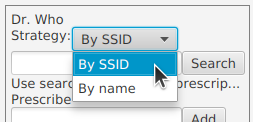
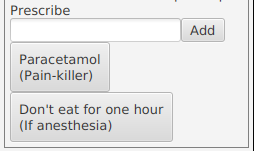

# TP3 - Design patterns

## Objectifs

Il vous est demandé d’effectuer une ré-ingénierie d’un code existant en mettant en œuvre les patrons de conception vus en cours.

Ceci devrait vous prendre 2 ou 3 séances.

### Déroulement

Ce TP est organisé en deux étapes :

- une ré-ingénierie (refactoring) du code utilisé dans les premiers TP afin de mieux structurer le projet et de le rendre plus modulaire,
- l’extension des fonctionnalités pour réaliser un programme plus complet.

Le plus simple est de partir répertoire `mes/` fourni dans votre archive. Si vous le souhaitez, vous pouvez aussi repartir d'un répertoire vierge, mais attention à ne rien oublier au passage, et si vous faites cela, vous n'aurez plus la possibilité de récupérer les mises à jour du squelette avec un simple `git pull moy master` !

### Ressources

- [Cours (et pointeurs à la fin du cours) sur les Design patterns](https://perso.liris.cnrs.fr/lionel.medini/enseignement/M1IF01/CM-patterns.pdf)
- [Aide à la mise en place du pattern MVC pour ce TP](./mvc.md)

## Consignes

Il est demandé de travailler en binômes.

Vous devriez avoir déjà rempli le champ URL sur TOMUSS pour indiquer votre dépôt forge et votre binôme,
*Cf*. instructions dans [../projet-note.md](../projet-note.md). Si ce n'est pas encore fait, faites-le maintenant.

### Outils

Il est conseillé d'utiliser un IDE capable de générer des diagrammes UML à partir du code, ou mieux, de faire du __round-trip engineering__ (prendre en compte les modifications du code dans les schémas et inversement). C'est le cas avec IntelliJ, et Eclipse avec un plugin comme [Object Aid](https://www.objectaid.com/) (explications rapides en vidéo [ici](https://www.youtube.com/watch?v=0Zlh56mTS6c)). VS Code n'est pas très bon pour cela, donc si vous utilisez VS Code, le mieux est de passer par un outil externe si vous voulez générer des diagrammes UML.

Il est aussi possible de [générer un diagramme de classe via JavaDoc et PlantUML](https://github.com/talsma-ict/umldoclet), le fichier `pom.xml` fourni fait cela (`mvn javadoc:javadoc` ou `mvn site`). Attention, on trouve beaucoup de documentation sur le web sur un doclet UMLGraphDoc, mais celui-ci est cassé depuis Java 8.

### Qualité du code

Le but de ce cours en général est de vous apprendre à écrire du code propre (irréprochable ?). 
On accordera une attention particulière à la qualité du code à tous les niveaux (style, indentation, architecture...). 
Privilégiez la qualité du code à la quantité de fonctionnalités.

## Partie 1 : Ré-ingénierie

Le code fourni lors de la première séance est ensemble de classes
relativement fouillis (nous en avons déjà parlé dans
[architecture-et-dependances.md](../TP1-java/architecture-et-dependances.md)).
En particulier les couches graphique et métier ne sont pas séparées.
Il va vous falloir réorganiser le code en appliquant les patrons de conception adéquats.

### Pattern Modèle-Vue-Contrôleur

Vous allez maintenant redéfinir la structure de base de l’application.
Mettez en place un pattern MVC pour :

- séparer le métier (la logique de l'application) et l’affichage
  des éléments (boutons et champs textes),

- propager les changements du modèle métier (statut des utilisateurs, ...) dans la vue,

- répercuter les entrées utilisateur (clic sur un bouton, validation
  d'un champ texte avec la touche « entrée »...) sous la forme
  adéquate dans le modèle métier.

Pour vous aider, vous pouvez utiliser les slides du cours sur les patterns contrôleur et MVC, ainsi que le document [Mettre en place le pattern MVC](mvc.md). Ce document propose des questions pertinentes à se poser, ainsi que quelques éléments de réponses, mais ce ne sont ni les seules questions ni les seules réponses pertinentes.

**Pour chacun des patterns implémentés à partir de cette partie, vous décrirez (en 1 ou 2 paragraphes) pourquoi vous avez choisi de l'utiliser, et vous fournirez dans votre rapport un/des diagramme(s) UML illustrant comment vous l'avez mis en œuvre.**

#### Flexibilité du modèle MVC

Une des propriétés du MVC est qu'on peut avoir un nombre quelconque de vues, identiques ou non, d'un modèle donné.
On peut vérifier simplement que notre MVC vérifie cette propriété en ajoutant quelque chose comme ceci dans le programme principal :

```java
        // First view, provided in skeleton
        new JfxView(c, stage, 600, 600);

        // Second view
        new JfxView(c, new Stage(), 400, 400);
```

Vous devriez voir une deuxième fenêtre, de taille différente, qui affiche
l'interface graphique. Les deux fenêtres doivent être synchronisées : toutes les
actions importantes faite dans l'une est répercutée immédiatement dans l'autre
(bien sûr, il y a aussi des choses qui restent locales à la vue, par exemple
quand on entre une ordonnance dans le champ texte, le texte entré n'est propagé
vers le modèle et les autres vues qu'au moment où on valide avec le bouton « add »).

Remarque : si la deuxième fenêtre vous gêne, mettez en commentaire le
morceau de code concerné, mais conservez-le obligatoirement et vérifiez qu'il marche
toujours au moment du rendu.

### Autres patterns

Reprenez les transparents du cours et parcourez la liste des patterns GRASP, des patterns de création, de structure, des principes SOLID, et posez-vous la question de leur applicabilité sur votre projet.
Appliquez ceux qui vous semblent pertinents, et de la même façon que précédemment, documentez cela dans votre rapport (si possible, en suivant la progression du cours : GRASP, création, structure...).

Vous devrez avoir au moins 3 patterns autres que MVC appliqués dans votre projet et décrits dans votre rapport.

### Anticiper sur le TP 4 "test"

Avant d'aller plus loin sur les extensions, c'est une bonne idée de progresser en tests : nous serons plus en sécurité pour continuer le refactoring et les extensions avec une bonne base de tests. 
Allez jeter un œil au [TP "Test"](../TP4-tests/README.md) (en particulier la section sur le TDD), et revenez pour la suite de ce TP après.
À vous de voir dans quel ordre vous voulez avancer précisément.

## Partie 2 : Extension

Dans toute cette partie, l'ajout de fonctionnalité est un prétexte pour se servir de design patterns. Dans la vraie vie, bien sûr, c'est au client ou à l'expert métier de décider des fonctionnalités pertinentes, mais exceptionnellement dans ce projet un peu artificiel on peut s'autoriser à choisir une fonctionnalité parce qu'elle sera intéressante à implémenter.
Ajoutez chaque fonctionnalité en appliquant les principes et patterns vus en cours, et justifiez-la dans le rapport.

### Rappel des extensions obligatoires du TP1

Pendant le TP1, vous avez du faire ces modifications :

- Un autre type de professionnel de santé (autre que Dentiste et Homéopathe)

- Ajout dynamique de patient (le bouton est dans le squelette, vous avez du coder la fonctionnalité)

- Suppression d'une ordonnance par un patient : on vous a dit au TP1 d'y réfléchir, mais implémenter ceci dans une base de code non-MVC n'est pas évident. Maintenant que vous avez nettoyé votre base de code, cet ajout devrait être sans douleur.

Assurez-vous que ces modifications fonctionnent toujours et qu'elles sont codées proprement en suivant le principe MVC.

### Ajout d'un deuxième type de professionnel de santé

Pour vérifier que votre base de code est bien évolutive : ajoutez un 4ème type de professionnel de santé, avec au moins deux ordonnances pré-définies. Cet ajout ne doit modifier que le modèle (création d'une classe, et instanciation dans `MES.createExampleConfiguration` en une ligne). C'est tout ce qu'on aime dans ce cours : ajouter des fonctionnalités doit pouvoir se faire en ajoutant du code, mais sans modifier le code existant, ou presque :-).

### Stratégies de recherche

Pour l'instant, le champ « recherche » des professionnels de santé ne permet que
de faire une recherche via un numéro de sécurité sociale.

Modifiez cela pour permettre une recherche avancée. Le professionnel de santé
doit pouvoir choisir entre plusieurs stratégies de recherche, par exemple comme
ceci :



Dans un premier temps, implémentez la recherche par nom, par exemple saisir
« Alice Foo » doit sélectionner l'utilisatrice correspondante.

Attention bien sûr à maintenir votre code factorisé au maximum : pas
de duplication de code d'une stratégie à l'autre !

Si vous êtes tentés d'écrire du code de la forme

```java
if (strategie == 1) { // NON
    ...
} else {
    ...
}
```

Relisez votre cours sur les design-patterns, il y a plus propre et extensible
... (et non, un `switch` à la place du `if / else if / else` n'est pas une
solution satisfaisante : ajouter une stratégie demanderait de modifier le code
existant).

Il est vivement conseillé d'utiliser la classe `ComboBox` de JavaFX (voir par
exemple [ce tutorial](https://melo-code.com/javafx-combobox/)). Cette classe
permet de créer un menu déroulant à partir d'une liste de `String`, ce qui ne
serait pas une très bonne idée (cela nous obligerait ensuite à analyser les
chaînes de caractères pour choisir la stratégie, donc une modification de
l'interface comme par exemple une traduction des chaînes de caractères dans une
autre langue casserait tout). Il est beaucoup plus judicieux de créer le menu à
partir d'une liste de classes, chacune implémentant la méthode
`toString()` correctement. Autrement dit, c'est une mauvaise idée d'utiliser
`ObservableList<String>` ici. Et d'une manière générale, les chaînes de
caractères de l'interface utilisateur ne doivent jamais être utilisées dans la
logique métier.

On s'autorisera quelques simplifications, par exemple ne rien faire si aucun
utilisateur n'est trouvé, et prendre le premier utilisateur correspondant s'il y
en a plusieurs.

### Une troisième stratégie de recherche

Ajoutez maintenant la stratégie « recherche par préfixe de nom », qui permet de
trouver un utilisateur en entrant le début de son nom (par exemple, juste
« Alice », ou même juste « Al » pour trouver « Alice Foo »). Là encore, si vous
avez bien travaillé à l'exercice précédent, cela doit se faire en ajoutant une
classe (triviale) et en l'ajoutant à une liste de stratégies disponibles, mais
le code existant ne doit pas être modifié.

### Création des utilisateurs

Jusqu'ici, nous avons pour simplifier utilisé une configuration (liste
d'utilisateurs, de professionnels de santé, et ordonnances déjà écrites) codée
en dur dans `mes.createExampleConfiguration`. C'est acceptable pour du code
jouet, mais vraiment sale dans l'absolu ... 

Trouvez un moyen plus propre de créer une configuration initiale au lancement de
l'application. Une solution propre est d'utiliser de la configuration au lieu de
programmation : la configuration initiale peut être écrite dans un fichier (par
exemple, Yaml ou XML) qui sera lue par notre programme. Mais vous pouvez
utiliser n'importe quel pattern de création ici. On peut même aller plus loin et
avoir une configuration persistante d'une exécution à l'autre avec un
[DAO](https://en.wikipedia.org/wiki/Data_access_object).

### Modification de l'interface pour les ordonnances pré-définies

Pour aider les professionnels de santé, ajoutez une indication sur la situation
dans laquelle une ordonnance prédéfinie est appropriée. L'interface pourra ressembler à ceci :



Cliquer sur le bouton ajoute seulement la prescription, pas la partie entre
parenthèse.

Vous pouvez vous amuser à changer l'interface utilisateur (par exemple mettre le texte entre parenthèse en dehors du bouton, ou utiliser une `ComboBox` à la place des `Button`s), ceci doit pouvoir se faire sans douleur sans aucune modification autre que la vue.

### Autre chose ?

Vous n'en avez pas assez ? Vous voulez ajouter Un système de messagerie entre patients et professionnels de santé ? Un diagnostique automatique à base de réseaux de neurones ? À vous de jouer !

## Rendu du TP / projet

Voir les consignes **À RESPECTER IMPÉRATIVEMENT** dans
[../projet-note.md](../projet-note.md).
