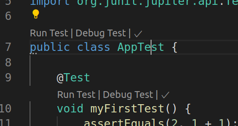
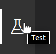

# TP4 - tests

## Objectif

L'objectif du TP est de mettre en place une base de tests automatisée avec JUnit. Idéalement c'est à faire en parallèle avec le refactoring et les nouvelles fonctionnalités, mais si vous préférez faire chaque chose en son temps, vous devriez arriver sur ce TP vers la 6ème séance de TP.

Le TP démarre par un « tutorial » (non-noté) sur les tests unitaires en Java, que vous devez ensuite mettre en application sur votre projet (noté).

## Préambule

Pour cette séance, il est recommandé d'utiliser un IDE. Ce document donne quelques pistes en utilisant VSCode et Eclipse, et vous trouverez ci-dessous des liens vers des pages expliquant les manipulations demandées avec IntelliJ :

- [Création d'un test unitaire](https://www.jetbrains.com/help/idea/create-tests.html)
- Pour lancer les tests, il faut d'abord [créer une configuration](https://www.jetbrains.com/help/idea/creating-run-debug-configuration-for-tests.html) avant de [les exécuter](https://www.jetbrains.com/help/idea/performing-tests.html)
- Un tutoriel pour le [Test Driven Development](https://www.jetbrains.com/help/idea/tdd-with-intellij-idea.html)

N'hésitez pas à proposer des conseils pour votre IDE préféré en faisant des pull-requests sur le dépôt enseignant.

Un corrigé incomplet est disponible dans le répertoire
[tp_test_corrige](tp_test_corrige/).

## Création d’un projet de test

Pour vous faire la main, vous allez travailler dans un squelette de projet Maven simple dans le répertoire [tp_test](tp_test).
Ce répertoire a été avec [l'archetype java8-junit5-archetype](https://github.com/thiagoprocaci/java8-junit5-archetype). Commencez par installer l'archétype localement (quand l'archetype est disponible sur le dépôt [Maven central](https://search.maven.org/), cette étape n'est pas nécessaire) :

```sh
git clone https://github.com/thiagoprocaci/java8-junit5-archetype.git
cd java8-junit5-archetype
mvn clean install
cd ..
rm -fr java8-junit5-archetype
```

Puis créez votre projet :

```sh
mkdir tp_test
cd tp_test
mvn archetype:generate \
 -DarchetypeGroupId=com.tbp \
 -DarchetypeArtifactId=java8-junit5-archetype \
 -DarchetypeVersion=1.0-SNAPSHOT
```

Répondez à quelques questions, comme quel est le :

- `groupId` : `fr.univ_lyon1.info.m1`

- `artefactId` : `tp_test`

- `version` : laissez la valeur par défaut (`1.0-SNAPSHOT`) en appuyant sur <kbd>Entrée</kbd>

- `package` : laissez la valeur par défaut (`fr.univ_lyon1.info.m1`)

## Parcours du projet de test

Le projet généré devrait ressembler à ceci (sous Linux, utilisez la
commande `tree` pour le vérifier d'un coup d'œil) :

```
.
├── pom.xml
└── src
    ├── main
    │   └── java
    │       └── fr
    │           └── univ_lyon1
    │               └── info
    │                   └── m1
    │                       └── App.java
    └── test
        └── java
            └── fr
                └── univ_lyon1
                    └── info
                        └── m1
                            └── AppTest.java
```

Le fichier `pom.xml` est assez standard, il active JUnit 5.2.0 (on peut
utiliser `mvn versions:display-dependency-updates` pour voir qu'il
existe une version plus récente de JUnit, mais cela ne change pas grand chose pour nous), et nous fournit deux
répertoires :

- `main/java/` votre groupId `/`, qui contiendra le code de nos
  programmes.

- `test/java/` votre groupId `/`, qui contiendra les tests.

## Lancement du test existant

Ouvrez la classe `AppTest`. On peut voir plusieurs choses dans le code :

- Un fichier de test JUnit est comme un fichier Java habituel, il contient une classe (en général nommée `QuelQueChoseTest` par convention),

- Les tests sont des méthodes annotées par `@Test`, et contenant des assertions comme `assertEqual(..., ...)`.

Selon votre IDE, vous avez probablement un moyen simple de lancer les tests. Par exemple, avec VSCode si vous avez installé le pack Java les tests apparaissent comme ceci et il suffit de cliquer sur « Run test » pour lancer le test :



On dispose aussi d'une barre latérale dédiée aux tests :



Sous Eclipse, faire <kbd>Alt</kbd>+<kbd>Shift</kbd>+<kbd>x</kbd> puis <kbd>t</kbd> pour
lancer le test, <kbd>Alt</kbd>+<kbd>Shift</kbd>+<kbd>d</kbd> puis
<kbd>t</kbd> pour faire la même chose en mode debug, ou à la souris :
Clic droit sur un fichier ou un projet → « Run as » → « JUnit
test »). vous aurez ainsi une jolie barre qui partira rouge et se colorera de
vert à mesure de votre avancée, et vous pourrez ouvrir l'éditeur sur
l'assertion fautive en un clic. Pour les maniaques des tests, vous pouvez même jouer avec le plugin
[infinitest](https://infinitest.github.io/) qui lance les tests en
tâche de fond à chaque fois que vous sauvez !

Lancer le test pour vérifier qu'il passe, puis essayez avec une assertion fausse (`assertEquals(2, 1)` par exemple) ou un `fail()` explicite et vérifier qu'il échoue.

On peut aussi bien sûr lancer les tests en ligne de commande. C'est aussi simple que :

```sh
mvn test
```

Vérifiez que les tests sont bien lancés, et regardez ce qu'il se passe quand des tests échouent.

En pratique, lancer les tests depuis l'IDE est intéressant pour le
confort au quotidien (bientôt, vous lancerez les tests aussi souvent
que vous compilez), et lancer les test en ligne de commande via `mvn
test` est indispensable pour l'intégration continue (où vos tests
tourneront sur un serveur sans utilisateur humain ni interface
graphique).

## Écriture d'un programme à tester

Ouvrez ce projet avec votre IDE préféré si ce n’est pas déjà fait.
Créez l'interface `ICharManipulator` suivante :

```java
package fr.univ_lyon1.info.m1.tp_test;

public interface ICharManipulator {
    public String invertOrder(String s);
    public String invertCase(String s);
}
```

Créez maintenant une classe `ICharManipulator`, pour l'instant vide :

```java
package fr.univ_lyon1.info.m1.tp_test;

public class CharManipulator implements ICharManipulator {

}
```

Votre IDE devrait lever une erreur et vous proposer quelque chose comme « Add unimplemented method » (placer le curseur sur le nom de la classe, puis <kbd>Control</kbd>+<kbd>.</kbd> sous VSCode, <kbd>Control</kbd>+<kbd>1</kbd> sous Eclipse, click droit sur les lignes rouges → generate → implement methods ou bien <kbd>Control</kbd>+<kbd>I</kbd>), qui va générer des squelettes de méthodes pour vous.
La vie est trop courte pour écrire tout ça soi-même.

Laissez le corps des méthodes vides (juste un `return null;`) pour l’instant, vous les implémenterez après avoir écrit les tests.

## Création du premier test

Vous allez maintenant créer votre première classe de test. Le but est
d'écrire des tests automatiques (qui s'exécutent sans intervention de
l'utilisateur) : du code qui teste du code.

Vous pouvez créer la classe de test soit à la
main, soit en vous laissant guider par votre IDE (exemple sous
Eclipse : clic droit sur le projet → « New » → « Other... » →
« JUnit test case »). Sous Intellij, pour créer la classe de test rapidement : créer la classe java CharManipulatorTest, dans le corps faire alt + inser → test method → version de Junit souhaité. 
Vous devez obtenir une classe
`CharManipulatorTest` dans `src/test/java` (et non `src/main/java` !)
qui :

- ne dérive d’aucune classe

- contient un `import static org.junit.jupiter.api.Assertions.*;`; en haut de son fichier
  et bien sûr `import org.junit.jupiter.api.Test;`;

- possède une unique méthode, qui ne fait rien (si votre IDE a généré
  un appel à `fail(...)`, supprimez-le pour l'instant), et à laquelle
  est attachée une annotation `@Test`.

Attention, si votre classe dérive de `TestCase`, votre projet utilise
JUnit 3 !

## Création de (vrais) tests

Votre classe de tests va comporter trois parties : une pour chaque
fonctionnalité à tester. Par chance, les fonctionnalités que vous
voulez tester correspondent aux fonctions de la classe. Chacune des
parties comportera plusieurs fonctions de test : une pour chaque cas
de figure à tester. En règle générale, on crée une fonction pour
l’ensemble des cas "standards", puis une pour chaque cas particulier
que l’on a repéré. Si vous n’êtes pas familier avec JUnit 5, un
récapitulatif de ses possibilités est présenté
[ici](https://howtodoinjava.com/junit-5-tutorial/).

Un test est classiquement écrit en 3 parties, que l'on appelle souvent
"Given/when/then" :

- "Given" (étant donné ...) construit les objets que l'on souhaite
  tester et amène le programme juste avant l'opération que l'on veut
  tester.
  
- "When" (quand ...) effectue l'action que l'on cherche à tester

- "Then" (alors ...) vérifie que l'action s'est bien déroulée comme on
  le souhaite.

Une manière un peu verbeuse de tester que la méthode `invertOrder`
fonctionne correctement sur l'entrée `"ABCD"` est donc :


```java
public class CharManipulatorTest {
    @Test
    public void testAbcd() {
    	// Given
    	CharManipulator manipulator = new CharManipulator();
    	
    	// When
    	String invert = manipulator.invertOrder("ABCD");
    	
    	// Then
    	assertEquals("DCBA", invert);
    }
}
```

Recopiez ce test dans votre projet, et vérifiez qu'il échoue (vous
n'avez pas encore codé `manipulator.invertOrder()` ...). Attaquez
l’implémentation de la fonction `invertOrder`. Vous pourrez ainsi tester
au fur et à mesure du développement et être emplis de joie en voyant
le nombre d’échecs diminuer.

Petite astuce pour passer des tests à l'implémentation : la plupart des IDE permettre de se rendre à la déclaration d'une fonction en faisant <kbd>Control</kbd>+clic sur l'appel de fonction.

En pratique on peut être beaucoup plus concis :

- La ligne `CharManipulator manipulator = new CharManipulator()` sera
  probablement la même pour tous les tests, on peut transformer
  `manipulator` en un champ de classe et l'initialiser avant le
  lancement du test (JUnit fournit une annotation `@BeforeEach` pour
  cela).
  
- Les deux lignes `String invert = ...` et `assertEquals(..., invert)`
  peuvent être groupées en une.
  
- Ici, le test est suffisamment simple pour qu'on accepte de mettre
  plusieurs tests dans la même fonction (mais ce n'est pas une bonne
  idée pour les tests non-triviaux, entre autres car cela empêche
  d'exécuter les tests qui arrivent après une assertion violée).
  
Au final, on arrive à ceci :
  
```java
public class CharManipulatorTest {

    private CharManipulator manipulator;
    
    @BeforeEach
    public void setUp() {
        manipulator = new CharManipulator();
    }

    @Test
    public void orderNormalString() {
        assertEquals("A", manipulator.invertOrder("A"));
        assertEquals("DCBA", manipulator.invertOrder("ABCD"));
        assertEquals("321DCBA", manipulator.invertOrder("ABCD123"));
    }
	
    @Test
    public void orderEmptyString()
    {
        assertEquals("", manipulator.invertOrder(""));
    }
}
```

Quelques compléments :

- JUnit fournit aussi une annotation `@AfterEach`, symétrique de
  `@BeforeEach`, qui peut être utilisée pour nettoyer les ressources
  allouées par `@AfterEach` (en pratique le garbage-collector de Java fait
  souvent tout ce qu'il faut donc `@AfterEach` est plus rarement utilisé).
  
- On peut aussi exécuter un morceau de code avant et après l'ensemble
  des tests d'une classe via `@BeforeAll`

- Les fonctions de tests seront appelées par JUnit, mais jamais par
  vous-mêmes. Il n'est donc pas gênant d'avoir des noms de fonctions
  longs, au contraire ! N'hésitez pas à utiliser des noms très
  expressifs. Par exemple le dernier test aurait pu s'appeler
  `invertOrderEmptyStringReturnsEmptyString()`. L'intérêt de ces noms
  à rallonge est qu'on sait immédiatement de quoi il s'agit quand on
  voit un rapport d'échec de test.

Faites ensuite de même pour `invertCase`. Pour préciser :

- La fonction `invertCase` est censée inverser la casse, c’est-à-dire inverser les majuscules et les minuscules.

- exemple : "abCD" → "ABcd"

### Assertions riches avec Hamcrest

La bibliothèque Hamcrest permet d'écrire des assertions plus proches de la langue naturelle, donc potentiellement plus lisibles. Nous l'utilisons dans le squelette fourni pour votre projet.

Commencez par replacer la dépendance sur `org.junit.platform` par `org.hamcrest` dans le `pom.xml` :

```xml
        <dependency>
            <groupId>org.hamcrest</groupId>
            <artifactId>hamcrest-all</artifactId>
            <version>1.3</version>
            <scope>test</scope>
        </dependency>
```

Puis modifiez votre assertion :

```java
import static org.hamcrest.CoreMatchers.is;
import static org.hamcrest.MatcherAssert.assertThat;
// ...
        assertThat(invert, is("DCBA"));
```

L'intérêt est plus évident quand on teste des propriétés plus complexes, comme par exemple sur des conteneurs (vous devrez probablement les utiliser dans votre projet) :

```java

    @Test
    public void testMap() {
        // Given
        Map<String, Integer> map = new HashMap<>();

        // When
        map.put("Foo", 42);

        // Then
        assertThat(map, hasKey("Foo"));
        assertThat(map, not(hasKey("Bar")));
        assertThat(map, hasEntry("Foo", 42));
    }

    @Test
    public void testList() {
        // Given
        List<String> list = new ArrayList<>();

        // When
        list.add("Bar");

        // Then
        assertThat(list, contains("Foo"));
    }
```

### Test-Driven Development (TDD)

C'est en général une bonne idée d'écrire les tests avant d'écrire le
code. Une bonne discipline est même : ne jamais écrire de code dans le
programme tant qu'on n'a pas un test qui échoue (et qui dicte ce qu'on
doit écrire).

Nous allons l'appliquer pour ajouter une fonction `removePattern` à
notre programme. La fonction `removePattern` doit retourner la
première chaîne de caractère à qui l’on a enlevé toutes les
occurrences d'une autre chaîne.

#### Écriture du test

Commencez par écrire un test (avant de toucher quoi que ce soit au
programme). Un premier test peut par exemple vérifier :

```java
assertEquals("cc", manipulator.removePattern("coucou", "ou"));
```

Pensez vos tests non seulement comme un moyen de vérifier votre
programme, mais aussi comme un exemple d'utilisation. Ici, en
écrivant le test on a aussi décidé que `removePattern` allait prendre
deux arguments : la chaîne puis le pattern à supprimer. Dans des cas
plus compliqués, les parties "Then" et "When" du tests peuvent être
non-triviales à écrire, mais c'est en général plus facile de
concevoir une API en écrivant des exemples d'utilisation (donc des
tests) qu'en écrivant l'API directement.

A ce stade, votre code ne compile pas car la fonction n'existe pas.
Votre IDE a probablement souligné `removePattern`.

#### Squelette de code

Pour écrire le code nécessaire pour que votre test soit compilable,
vous pouvez vous aider de votre IDE. Par exemple avec VSCode, <kbd>Control</kbd>+<kbd>.</kbd> ; sous Eclipse, en
passant la souris sur le code souligné (ou bien <kbd>Control</kbd>
+<kbd>1</kbd> au clavier),
l'IDE propose comme correction du problème « create method
`removePattern(...)` ». Choisissez cette option : l'IDE génère pour
vous un squelette de méthode. Vérifiez et adaptez le prototype de la
fonction. Par exemple, Eclipse a généré une méthode avec un type de
retour `Object`, il faut mettre `String` à la place. Si votre IDE a
bien deviné les types des arguments, il n'a probablement pas inventé
de nom pertinent : à vous de le faire.

Une fois le squelette de méthode concrète défini, on peut demander à
l'IDE de l'ajouter dans l'interface (toujours
<kbd>Control</kbd>+<kbd>1</kbd> sous Eclipse, puis « create
`removePattern()` in super type »).

Vous pouvez maintenant lancer le test : il est compilable, mais doit
échouer. S'il n'échoue pas, c'est que vous avez mal écrit votre test
(auquel cas c'est le bon moment pour le corriger), ou que la
fonctionnalité existe déjà (et c'est le bon moment pour s'en rendre
compte). La règle d'or en TDD : on n'écrit pas de nouveau code si on n'a
pas un test qui échoue.

#### Écriture du code dans le programme

L'étape suivante est d'écrire le code nécessaire pour que le test
passe. Dans cette phase on s'autorise souvent à écrire du code
temporaire pour que le test passe, et on le nettoiera juste après. Par
exemple ici on peut écrire :

```java
public String removePattern(String string, String string2) {
    return "cc"; // TODO
}
```

(En n'oubliant pas le `TODO` qu'il faudra supprimer avant d'oublier)

#### Refactoring

Maintenant que les tests passent, on peut s'occuper de refactorer le
code, de remplacer les morceaux de code temporaires par le vrai
code, ...

Votre IDE peut vous aider ici aussi (sous VSCode, regardez le contenu
de menu « Refactor », accessible via un clic droit sur du code ou bien
<kbd>Control</kbd>+<kbd>Shift</kbd>+<kbd>r</kbd>, sous Eclipse c'est <kbd>Shift</kbd>+<kbd>Alt</kbd>+<kbd>t</kbd>). Refaites passer les
tests régulièrement pour vérifier que vous n'avez rien cassé.

#### Commit :-)

Voila, vous avez un code irréprochable et bien testé. Un `git commit`
et sans doute un `git push` s'imposent.

#### goto "Écriture du test"

Recommencez jusqu'à épuisement du développeur ! Ajoutez des tests pour
des cas particuliers que vous risquez d'avoir oublié (avez-vous pensé
à `removePattern("aabb", "ab")` par exemple ?), ou pour des nouvelles
fonctionnalités de votre programme.

Pour l'exercice, vous devez avoir 3 fonctions dans l'interface et au
moins 3 tests par fonction. Quand c'est fait, passez à la partie
intéressante : l’implémentation des tests pour votre projet.

### Aller plus loin

Quelques outils amusants si vous voulez creuser un peu la question des
tests :

- Les [outils de couverture de
  code](https://en.wikipedia.org/wiki/Java_Code_Coverage_Tools) qui vous
  permettent de savoir quelles instructions sont exécutées (« couvertes ») par
  vos tests, et donc quelles parties du programme n'ont pas été testées. Ces
  outils peuvent s'intégrer à Maven et à votre IDE. Le `pom.xml` fourni génère
  automatiquement un rapport de couverture JaCoCo dans
  `target/site/jacoco/index.html`, vous pouvez l'utiliser pour repérer les
  portions non-testées de votre base de tests.
  
- Les outils de mock comme [Mockito](https://site.mockito.org/), qui
  vous permettent de fabriquer des « mocks », c'est à dire des faux
  objets, pour tester une classe sans avoir besoin d'instancier ses
  dépendances. Par exemple, on pourrait tester le contrôleur de notre
  programme MVC en isolation en faisant des « mocks » de la vue et du
  modèle.
  
## Tests unitaires du projet

Vous avez probablement beaucoup modifié le projet de base lors du TP
de refactoring. Si vous aviez appris le TDD plus tôt, vous auriez
écrit les tests avant de refactorer, mais il n'est jamais trop tard !

A ce stade, vos projets sont tous différents donc il n'y a pas de consignes
précises (mais il est obligatoire de faire des tests !). Quelques conseils pour
vous lancer :

- Tester le modèle est assez simple, le contrôleur peut-être un peu
  plus dur mais faisable, la vue relativement difficile.
  
- Concentrez-vous sur les tests automatiques, mais vous pouvez aussi faire des
  tests manuels quand les tests automatiques sont impossibles ou trop difficiles
  (c'est difficile d'instancier des classes JavaFX dans des tests automatiques
  ...). Documentez dans votre rapport quels tests manuels vous avez fait (sauf
  si vous avez réussi à tester *tout* votre code automatiquement).

- Écrivez vos tests avant l’implémentation : comme ça vous réfléchissez
  à tous les cas étranges pendant vos tests, qui sont au demeurant
  simples à coder, et vous pourrez vous concentrer sur les problèmes
  de code lors de l’implémentation.

- Vous êtes en binôme, profitez-en ! Donnez les tests d’une partie à
  l’un des membres du binôme, et faites-la implémenter par l’autre ;
  cela peut paraître contre-productif, mais c’est ce qui vous
  permettra de couvrir tout de suite tous les cas particuliers.

- Pensez à tester aussi les cas "normaux", cela vous permettra de
  distinguer une fonction mal codée d’une fonction pas codée du tout
  ou inaccessible.

Que doivent faire les tests à minima :

- Tester que les différentes stratégies de sélection de CV fonctionnent.

- Tester que les actions du contrôleur (ajouter/supprimer une
  compétence recherchée par exemple) ont l'effet souhaité.

- ...

## Intégration continue avec Gitlab-CI

Bien sûr, l'intégration continue que nous avons mise en place au [TP2-outils](../TP2-outils/) doit toujours fonctionner et vu qu'elle lance `mvn test`, elle doit exécuter les tests unitaires à chaque push.

## Et maintenant ?

Vous venez de terminer le dernier TP. Relisez bien les consignes
([../projet-note.md](../projet-note.md)) pour votre projet et le rendu
sur TOMUSS.

Bon travail ! ;)
